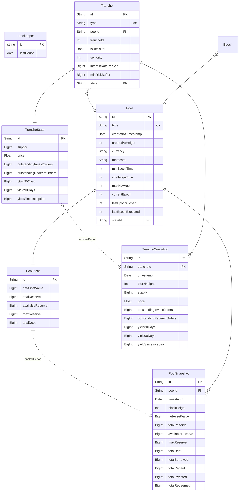

# Centrifuge Development

A development repository to combine and manage all necessary services to easily develop the centrifuge insights dashdoard.

_Figure: Architectural diagram of the development environment._

## Getting Started

### Prerequisites

- git
- docker
- docker-compose

### Initialize

    $ git clone --recurse-submodules git@github.com:embrio-tech/centrifuge-development.git
    $ cd centrifuge-development
    $ cp .env.sample .env

### Start

    $ docker-compose up --build

If you run this for the first time, it might take a while. :hourglass_flowing_sand: Get a coffee, sit back, and relax! :coffee: :palm_tree:

### Access

#### Centrifuge insights

The frontend can be accessed under the following link: [http://localhost:8010](http://localhost:8010/)

#### Centrifuge subql

The subql query playground is available here: [http://localhost:3000](http://localhost:3000/)

### Scrap

    $ docker-compose down -v

## Data Model

## Contact

[EMBRIO.tech](https://embrio.tech)  
[hello@embrio.tech](mailto:hello@embrio.tech)  
+41 44 552 00 75

## License

The code is licensed under the [GNU Lesser General Public License v2.1](https://github.com/embrio-tech/centrifuge-insights/blob/main/LICENSE)
